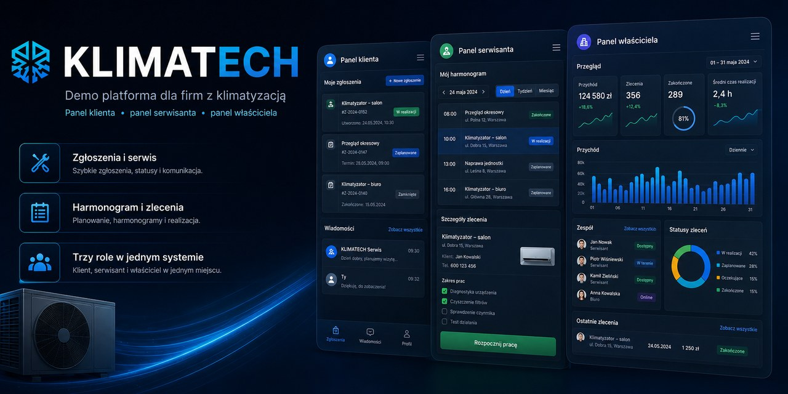

<p align="center">
  
</p>

<div align="center">

# ❄️ KLIMATECH

### Platforma SaaS do zarządzania firmą HVAC

**Panel klienta • Panel serwisanta • Panel właściciela**

<br>

[🚀 **OTWÓRZ LIVE DEMO**](https://klimatech-repo.vercel.app)

</div>

---

## 💡 Czym jest KLIMATECH?

**KLIMATECH** to demonstracyjna aplikacja SaaS stworzona dla firm zajmujących się montażem i serwisem klimatyzacji oraz pomp ciepła.

System łączy w jednym miejscu trzy najważniejsze strony całego procesu:

* 👤 **Klienta**
* 🔧 **Serwisanta**
* 📊 **Właściciela firmy**

Celem projektu jest uproszczenie obsługi zgłoszeń, planowania wizyt, realizacji zleceń oraz zarządzania firmą serwisową.

---

## 👤 Panel Klienta

Klient otrzymuje własny panel, w którym może:

* zgłaszać awarie i problemy,
* sprawdzać status zgłoszenia,
* przeglądać zaplanowane wizyty,
* śledzić historię serwisową urządzeń,
* przeglądać swoje urządzenia,
* komunikować się z firmą serwisową.

---

## 🔧 Panel Serwisanta

Serwisant otrzymuje panel dopasowany do codziennej pracy w terenie.

Może między innymi:

* przeglądać przypisane zlecenia,
* sprawdzać harmonogram dnia,
* otwierać szczegóły wizyty,
* przeglądać dane klienta,
* sprawdzać historię urządzenia,
* prowadzić checklistę wykonanych prac,
* dodawać notatki,
* aktualizować status realizacji.

---

## 📊 Panel Właściciela

Właściciel firmy otrzymuje centralny panel zarządzania.

Może:

* zarządzać klientami,
* zarządzać serwisantami,
* zarządzać urządzeniami,
* tworzyć i przypisywać zlecenia,
* planować wizyty,
* kontrolować statusy zleceń,
* monitorować aktywność zespołu,
* analizować dane i statystyki firmy.

---

## 🔄 Jak działa system?

```text
KLIENT
   ↓
Tworzy zgłoszenie
   ↓
WŁAŚCICIEL / BIURO
   ↓
Planuje wizytę i przypisuje serwisanta
   ↓
SERWISANT
   ↓
Realizuje zlecenie
   ↓
Aktualizuje status i dokumentację
   ↓
KLIENT + WŁAŚCICIEL
   ↓
Mają dostęp do historii wykonanej usługi
```

---

## 🚀 Live Demo

Aplikację możesz zobaczyć tutaj:

### 👉 [klimatech-repo.vercel.app](https://klimatech-repo.vercel.app)

Projekt działa online i pozwala zobaczyć sposób działania platformy z perspektywy różnych użytkowników.

---

## 🎯 Dla kogo?

KLIMATECH został zaprojektowany z myślą o:

* firmach HVAC,
* firmach montujących klimatyzację,
* serwisach klimatyzacji,
* instalatorach pomp ciepła,
* firmach posiadających kilku serwisantów,
* przedsiębiorstwach chcących uporządkować obsługę klientów i zleceń.

---

## 🧩 Trzy role — jeden system

| Rola              | Główne funkcje                                        |
| ----------------- | ----------------------------------------------------- |
| 👤 **Klient**     | Zgłoszenia, wizyty, urządzenia, historia, komunikacja |
| 🔧 **Serwisant**  | Harmonogram, zlecenia, realizacja, dokumentacja       |
| 📊 **Właściciel** | Klienci, zespół, zlecenia, statystyki, zarządzanie    |

---

## 🛠️ Technologie

### Frontend

* React
* TypeScript
* TanStack Start
* TanStack Router
* TanStack Query
* Tailwind CSS
* Radix UI
* Lucide Icons
* Recharts

### Backend i dane

* TanStack Start
* Drizzle ORM
* Neon PostgreSQL
* Better Auth
* Zod
* Resend

### Deployment

* Vercel
* GitHub

---

## 🔐 Bezpieczeństwo

Poufne dane aplikacji są przechowywane w zmiennych środowiskowych.

Przykład:

```env
DATABASE_URL=
```

Pliki `.env` oraz `.env*` są wykluczone z repozytorium przez `.gitignore`.

---

## 💻 Uruchomienie lokalne

### 1. Sklonuj repozytorium

```bash
git clone https://github.com/Wojtekkurwaboss/klimatech-serwis.git
```

### 2. Przejdź do projektu

```bash
cd klimatech-serwis
```

### 3. Zainstaluj zależności

```bash
npm install
```

### 4. Dodaj zmienne środowiskowe

Utwórz:

```text
.env.local
```

i dodaj wymagane dane konfiguracyjne.

### 5. Uruchom aplikację

```bash
npm run dev
```

---

## 📌 Status projektu

KLIMATECH jest obecnie **projektem demonstracyjnym i portfolio** pokazującym koncepcję rozbudowanej platformy SaaS dla branży HVAC.

Projekt może zostać dalej rozwinięty między innymi o:

* 💳 abonamenty i płatności,
* 🔔 automatyczne przypomnienia,
* 📱 aplikację mobilną dla serwisantów,
* 📦 magazyn części,
* 📄 faktury i dokumenty,
* 📲 powiadomienia SMS,
* 📧 automatyzacje e-mail,
* 📈 bardziej rozbudowane raporty,
* 🔌 integracje z innymi systemami.

---

## 🤝 Wdrożenie dla firmy

Platforma może być dalej dostosowywana pod potrzeby konkretnej firmy HVAC.

Możliwe jest dostosowanie:

* brandingu,
* funkcjonalności,
* paneli użytkowników,
* procesów firmy,
* automatyzacji,
* formularzy,
* raportów,
* struktury klientów i pracowników.

### 📧 Kontakt

**[wojtekzieba.w@gmail.com](mailto:wojtekzieba.w@gmail.com)**

---

<div align="center">

## ❄️ KLIMATECH

**Klient. Serwisant. Właściciel. Jeden system.**

[🚀 Live Demo](https://klimatech-repo.vercel.app) • [💻 GitHub](https://github.com/Wojtekkurwaboss/klimatech-serwis)

</div>
